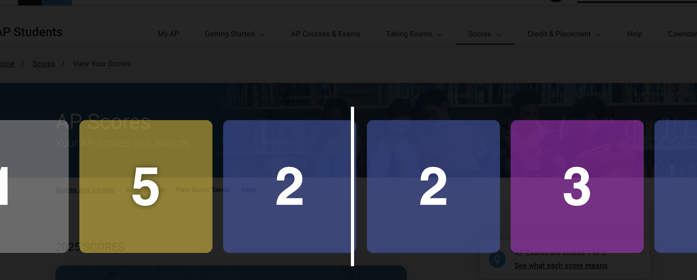

# ap-scores-csgo-case-reveal

installation is very easy
you NEED Chrome/Chromium

1. clone this repo locally
1. go to chrome://extentions/
2. Enable 'Developer Mode' in the top right
3. click 'Load Unpacked'
4. select this repo locally
5. enable it if not enabled already

